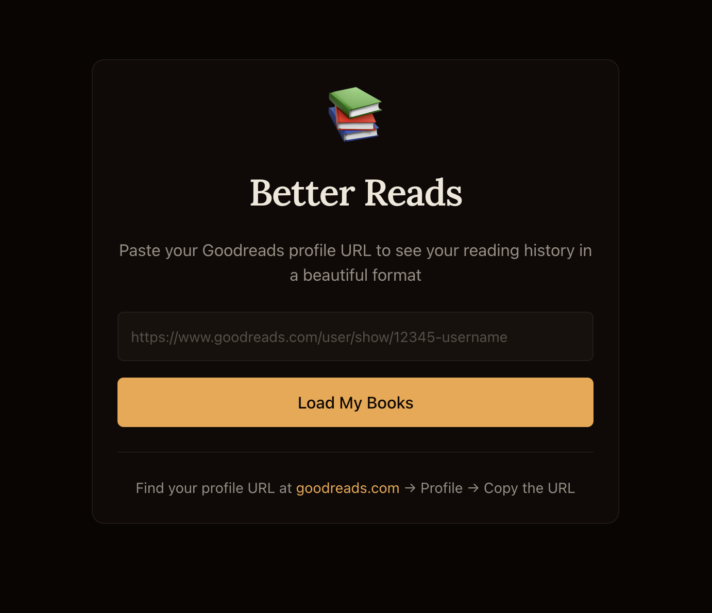

# Better Reads 📚



A simple app to view your Goodreads reading history.

## Getting Started

```bash
# Install dependencies
npm install

# Setup .env
OPENAI_API_KEY=your_key_here

# Start the development server
npm run dev
```

Open [http://localhost:3000](http://localhost:3000) and paste your Goodreads profile URL.

## Features

- Load any Goodreads profile via URL
- **AI-Powered Book Recommendations**: Get personalized gift suggestions based on a reader's 5-star rated books. The system analyzes their favorite reads and suggests 5 new books they're likely to enjoy, complete with cover images, genres, and personalized reasoning.
- Stats overview: total books, pages read, average rating, reviews
- Book cards with covers, ratings, dates, and reviews
- Local caching for instant reload

## Finding Your Profile URL

Here's my Goodreads profile url; you can use it to test:
```
"https://www.goodreads.com/user/show/23506884-ben"
```

1. Go to [goodreads.com](https://www.goodreads.com)
2. Click your profile avatar
3. Click "Profile"
4. Copy the URL from your browser

## Development

```bash
# Run tests
npm test

# Run tests once
npm run test:run

# Build for production
npm run build
```

## How It Works

Goodreads provides public RSS feeds for user bookshelves. This app:

1. Parses the user ID from the profile URL
2. Fetches the RSS feed for the user's "read" shelf
3. Caches the data locally in `cache/{userId}.json`
4. Renders the books in a beautiful grid layout

No API key or authentication required for public profiles!

### Recommendations

The recommendation system uses an llm to suggest perfect book gifts:

1. **Analyzes Favorites**: Identifies all books the reader rated 5 stars (up to 50 books)
2. **AI Generation**: Uses OpenAI's GPT model to generate 5 personalized recommendations based on reading patterns, genres, and themes from their favorites
3. **How to use**: Click the "Suggest a Gift" button on any profile page to generate recommendations

The system requires at least one 5-star rated book to generate recommendations.

## Tech Stack

- Next.js 16 with App Router
- TypeScript
- Tailwind CSS v4
- shadcn/ui components
- Vitest for testing


## Future features / ideas

- User profile login support
- Save gift ideas for friends and family
- Saved "friend/family" members for users
- Verify accuracy of book recommendations
- Suggest me something else (with optional additional context like past suggestions and user preference, e.g. "more horror")
- Nearby libraries, bookstores.
- Interesting book metrics:
    - People currently reading this book in your area
    - Number of people actively reading this book by country
    - Number of people who have read this
- Curated community-supported reading lists.
- Partnerships with universities; course reading lists.
- Top 5 books on your profile.


## Future technical improvements

- Feed all read books in as context to improve recommendations and eliminate chance of "already read" reccommendations

- Paginate / infinite scroll the reading history page.

- Relationalize, store in supabase:
    - `profiles`
        - `id` (uuid, PK)
        - `goodreads_user_id` (text, unique)
        - `user_name` (text, nullable)
        - `scraped_at` (timestamptz)
    - `books`
        - `goodreads_id` (text, PK)
        - `title` (text)
        - `author` (text)
        - `isbn` (text, nullable)
        - `pages` (int, nullable)
        - `avg_rating` (numeric, nullable)
        - `year_published` (text, nullable)
        - `image_url` (text, nullable)
        - `description` (text, nullable)
    - `user_books`
        - `id` (uuid, PK)
        - `profile_id` (uuid, FK → profiles)
        - `book_id` (text, FK → books.goodreads_id)
        - `my_rating` (smallint, **indexed**)
        - `my_rating_text` (text, nullable)
        - `date_read` (date, nullable)
        - `date_added` (date, nullable)
        - `review` (text, nullable)